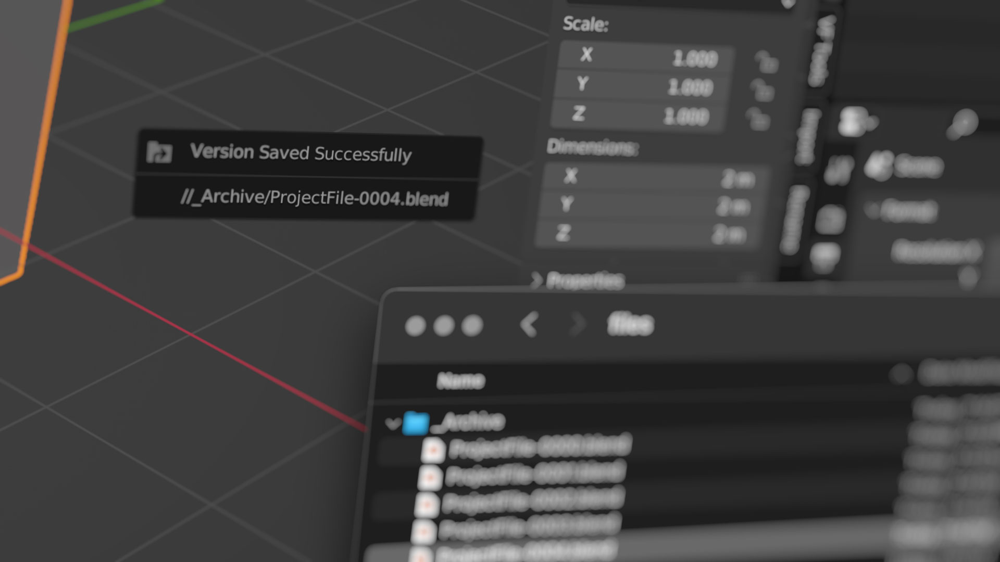

# VF Save Version

Saves the current Blender project in a subfolder or other directory path with a serial number or date and time using compression and linked asset remapping. Helps keep the root project directory clean even an artist is obsessive about saving progress as separate versions.

## Installation and Usage

- Download [VF_saveVersion.py](https://raw.githubusercontent.com/jeinselen/VF-BlenderSaveVersion/main/VF_saveVersion.py)
- Open Blender Preferences and navigate to the "Add-ons" tab
- Install and enable the add-on
- Adjust the versioning preferences as needed

The default settings will work as-is; saving the current project to an "_Archive" folder alongside the project file, with a new version number appended each time the save version command is used. The versioned files use compression to reduce `.blend` file size and have linked asset remapping enabled.

Default keyboard shortcuts are included for MacOS, Linux, and Windows systems:

- Command + Option + Shift + S
- Control + Option + Shift + S

These can be customised in the Blender Keymap preferences or by right-clicking on the entry at the bottom of the `File` menu.

## Preferences

- `Path` sets the location for versioned files
  - `/` = a folder alongside the project using the project name
  - Relative and absolute paths can also be used, the default is `//_Archive`

- `Separator` allows for custom text between the original project name and the serial number or date and time stamp
  - The default is simply a dash `-`, which will result in `ProjectName-XXXX`

- `Type ` switches between the available number options
  - `Serial Number` = automatically incrementing version number based on previously saved versions in the specified path, starting at 0000
  - `Date and Time` = current date and time using YYYY-MM-DD-HH-MM-SS format
  - `Alphanumeric` = major/minor versioning in number + character format (`001a`, `001b`, `001c` ... `002a` etcetera)
- `Digits` adjusts the zero padding for both `Serial Number` and `Alphanumeric` formats
- `Confirmation Popup` enables a small confirmation panel with the version output path when the script completes (it will always display success in the status bar)

## Alphanumeric Details

The `Alphanumeric` type is unique; instead of saving a compressed copy with incremented version number, it saves the current project with a new alphanumeric serial and then moves the previous project file into the specified location. It will not automatically compress anything, instead relying on whatever compression setting the current project file is using.

This approach is particularly necessary for users of [VF Autosave Render + Output Variables](https://github.com/jeinselen/VF-BlenderAutosaveRender). The `{project}` variable returns the current project name, so if an automatically named render needs to be associated with a specific project version (unrelated to the per-render serial number options in that plugin), the relevant version number needs to exist in the _active_ project name, not introducing serial numbers at the point of archival (though time stamps work, they're often not as readable, especially for tracking major/minor updates).

If no alphanumeric code exists, the original file will be moved to the versions, and a code will be added to the active project starting at `1a` (using however many digits are specified in the preferences). New alphanumeric versions will follow existing naming conventions; if you manually save a file using `name+00003g.blend`, subsequent versions will also use a plus sign and the separator specified in the plugin preferences will be ignored, but the number of digits will be enforced.

There are two options when saving a new alphanumeric version; assuming a starting code of `001c`, a minor version will become `001d`, whereas a major version will become `002a`.

The keyboard shortcut for a minor version increment is the same as other version types. The keyboard shortcut for a major version increment is tested in MacOS, but Linux and Windows systems may require manual customisation:

- Command + Option + Control + Shift + S

Note that if an alphanumeric file of the same name already exists when a new version is incremented, it will be replaced and renamed with a ".blend1" extension (assuming default Blender settings for backups). However, subsequent saving of the new versioned file will replace that backup with its own backup, and the original file will be lost. This isn't likely! But could happen if alphanumeric versions are manually changed or old versions are restored, then edited and iterated without checking if they're overwriting an existing version.

## Notes

- This add-on is provided as-is with no warranty or guarantee regarding suitability, security, safety, or otherwise. Use at your own risk.
